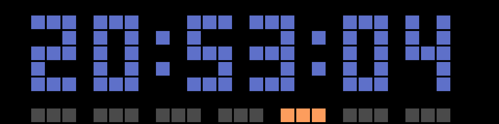

<!-- markdownlint-configure-file {
  "MD013": {
    "code_blocks": false,
    "tables": false
  },
  "MD033": false,
  "MD041": false
} -->

<div align="center">

🌐 **Español** | [English](README_EN.md)


**Firmware personalizado para el [Reloj Pixel Inteligente Ulanzi TC001](https://www.ulanzi.com/products/ulanzi-pixel-smart-clock-2882?ref=28e02dxl)**

[](https://github.com/XE1E/svitrix-firmware-XE1E/releases)
[](https://github.com/XE1E/svitrix-firmware-XE1E)
[](https://claude.ai)

[Inicio Rápido](#inicio-rápido) · [Características](#características) · [API](#api) · [Documentación](https://xe1e.github.io/svitrix-firmware-XE1E/) · [FAQ](#faq)

</div>

<div align="center">
  
</div>

---

SVITRIX-XE1E es un compañero para hogar inteligente diseñado para HomeAssistant, IOBroker, NodeRed y otros sistemas de automatización. Funciona directamente con apps preinstaladas de hora, fecha, temperatura, humedad, batería y **clima** (temperatura exterior, humedad, presión y calidad del aire vía WeatherAPI.com). Para usuarios avanzados, la potente API MQTT y HTTP permite crear apps personalizadas, enviar notificaciones y controlar cada aspecto de la pantalla.

SVITRIX-XE1E es un fork de [SVITRIX](https://github.com/svitrix/svitrix-firmware), que a su vez es un fork comunitario del proyecto original [AWTRIX 3](https://github.com/Blueforcer/awtrix3).

> **Nota:** En SVITRIX-XE1E, las "Apps Personalizadas" no son aplicaciones tradicionales que instalas. Son páginas dinámicas que rotan en la pantalla, mostrando contenido enviado desde un sistema externo vía MQTT o HTTP. Toda la lógica se maneja desde tu hogar inteligente — SVITRIX-XE1E proporciona la pantalla.

## Características

### Apps Nativas
- **Hora** — múltiples modos incluyendo reloj de dígitos grandes, reloj binario, caja de calendario, barra de día de semana
- **Fecha** — fecha formateada con indicador de día de la semana
- **Temperatura y Humedad** — lecturas internas de sensores I2C (SHT3x, BME280, etc.)
- **Batería** — porcentaje de carga con icono animado
- **Apps de Clima (NUEVO)** — temperatura exterior, humedad, presión y calidad del aire vía [WeatherAPI.com](https://weatherapi.com)
  - Ubicación configurable (nombre de ciudad, coordenadas, auto-detectar por IP, o ID de estación)
  - Iconos de condición climática (soleado, nublado, lluvioso)
  - Configuración de color y duración por app
  - Iconos animados de LaMetric desde la carpeta `/ICONS/`

### Conectividad e Integración
- **API MQTT y HTTP** — control total sobre apps, notificaciones, configuración y pantalla
- **Apps Personalizadas** — crea páginas dinámicas desde tu hogar inteligente sin recompilar
- **Descubrimiento HomeAssistant** — integración automática con HA
- **Multi-red WiFi** — configura hasta 3 redes WiFi con respaldo automático
- **Artnet (DMX)** — usa SVITRIX-XE1E como receptor Artnet

### Pantalla y Efectos
- **19 efectos visuales** — Fuegos artificiales, Matrix, Plasma, Snake y más como fondos de apps
- **Overlays de clima** — efectos de nieve, lluvia, tormenta, truenos, escarcha
- **Transiciones deslizantes** — transiciones suaves entre apps con múltiples estilos
- **Iconos animados y estáticos** — descarga desde la galería LaMetric o sube los tuyos
- **API de dibujo** — píxeles, líneas, rectángulos, círculos, texto y bitmaps
- **Gráficas de barras y líneas** — muestra gráficas de datos directamente en la matriz
- **Indicadores de colores** — pequeños puntos de notificación en las esquinas de la pantalla
- **Luz ambiental** — convierte la matriz en una luz de ambiente
- **Paletas de colores personalizadas** — crea tus propias paletas de 16 colores para efectos
- **Brillo automático** — brillo mín/máx configurable con sensor LDR

### Notificaciones y Sonido
- **Notificaciones** — mensajes únicos con iconos, sonidos y efectos
- **Melodías RTTTL** — reproduce sonidos monofónicos vía el buzzer incorporado

### Configuración y Gestión
- **Interfaz web moderna** — configuración WiFi, MQTT, clima, gestor de archivos, descargador de iconos, actualizaciones OTA, vista en vivo
- **Menú en pantalla** — cambia configuraciones directamente en el dispositivo con los botones
- **Duración por app** — configura el tiempo de visualización para cada app nativa
- **Opciones de formato de hora** — 12/24 horas, formatos personalizados, Celsius/Fahrenheit
- **Modo nocturno** — cambios automáticos de brillo y color por hora del día
- **Flasher en línea** — flashea directamente desde tu navegador vía USB
- **Respaldo y restauración** — respaldo completo del flash como archivo zip
- **Sin nube, sin telemetría**

## Inicio Rápido

1. **Flashear** — conecta el Ulanzi TC001 vía USB y usa el [flasher en línea](https://xe1e.github.io/svitrix-firmware-XE1E/flasher)
2. **Conectar** — únete a la red WiFi `svitrix_XXXXX` (contraseña: `12345678`)
3. **Configurar** — abre `http://192.168.4.1` e ingresa las credenciales de tu WiFi
4. **Usar** — el dispositivo muestra la versión, luego desplaza "SVITRIX XE1E" con IP y nombre mDNS; abre la IP en un navegador para la interfaz web
5. **Clima (opcional)** — obtén una clave API gratuita de [WeatherAPI.com](https://weatherapi.com) y configúrala en Configuración → Clima

Para instrucciones detalladas, consulta la [Guía de Inicio Rápido](https://xe1e.github.io/svitrix-firmware-XE1E/quickstart).

## API

SVITRIX-XE1E proporciona una API dual MQTT/HTTP. Algunos ejemplos:

**Enviar una notificación:**

```bash
curl -X POST http://<ip>/api/notify \
  -d '{"text": "¡Hola!", "icon": "1234", "duration": 10, "rainbow": true}'
```

**Crear una app personalizada:**

```bash
curl -X POST "http://<ip>/api/custom?name=miapp" \
  -d '{"text": "23°C", "icon": "2056", "lifetime": 900}'
```

**Cambiar configuración:**

```bash
curl -X POST http://<ip>/api/settings \
  -d '{"BRI": 120, "TMODE": 1, "ATIME": 5}'
```

**Configurar clima:**

```bash
curl -X POST http://<ip>/api/weather \
  -d '{"apiKey": "tu_clave", "locationType": 0, "city": "Ciudad de México", "showOutdoorTemp": true}'
```

**Obtener datos del clima actual:**

```bash
curl http://<ip>/api/weather/data
```

Referencia completa de API: [Referencia de API](https://xe1e.github.io/svitrix-firmware-XE1E/api)

## Hardware DIY

El Ulanzi TC001 usa un **ESP32-WROOM-32D** (8 MB flash, USB-Serial CH340) con una matriz de 32x8 WS2812B-Mini (256 LEDs).

| GPIO | Función | Notas |
|------|---------|-------|
| 32 | Matriz LED (WS2812B-Mini) | 256 LEDs, cableado serpentina |
| 15 | Buzzer (piezo pasivo) | PWM vía LEDC, necesita pull-down al iniciar |
| 21/22 | I2C SDA/SCL | SHT3x (0x44) + DS1307 RTC (0x68) |
| 26/27/14 | Botones Izq/Medio/Der | Active LOW, pull-up interno |
| 13 | Botón reset (oculto) | Mantener 5s → reset de fábrica |
| 34 | ADC voltaje batería | 4400 mAh, divisor de voltaje |
| 35 | Sensor de luz LDR (GL5516) | Detección de luz ambiental |

Sensores I2C soportados: BME280, BMP280, HTU21DF, SHT31 (auto-detectados al iniciar). Referencia completa de hardware: [Guía de Hardware](https://xe1e.github.io/svitrix-firmware-XE1E/hardware).

## FAQ

**¿Funciona SVITRIX-XE1E sin un sistema de hogar inteligente?**
¡Sí! Las apps integradas (hora, fecha, temperatura, humedad, batería) funcionan directamente. Las apps de clima funcionan de forma independiente solo con una clave de WeatherAPI.com. Las apps personalizadas y notificaciones requieren un sistema externo comunicándose vía MQTT o HTTP.

**¿Puedo usar una matriz de diferente tamaño?**
No. SVITRIX-XE1E está optimizado para 32x8 (256 LEDs).

**La lectura de temperatura parece muy alta.**
El sensor está dentro de la carcasa. Configura un offset en `dev.json` vía el gestor de archivos:

```json
{"temp_offset": -5, "hum_offset": -1}
```

**¿Cómo obtengo datos del clima?**
1. Regístrate para una cuenta gratuita en [WeatherAPI.com](https://weatherapi.com)
2. Copia tu clave API
3. Ve a Configuración → Clima en la interfaz web
4. Pega tu clave API y configura tu ubicación
5. Activa las apps de clima que quieras (Temp Exterior, Humedad, Presión, Calidad del Aire)

**¿Cómo actualizo el firmware sin USB?**
Usa la sección de actualización OTA en la interfaz web, o descarga el último `.bin` desde [GitHub releases](https://github.com/XE1E/svitrix-firmware-XE1E/releases).

Más respuestas: [FAQ](https://xe1e.github.io/svitrix-firmware-XE1E/faq)

## Desarrollo con IA

SVITRIX-XE1E se desarrolla usando un enfoque **IA-first**. [Claude](https://claude.ai) (Anthropic) es una parte central del flujo de trabajo de desarrollo — desde decisiones de arquitectura y generación de código hasta refactorización, testing y gestión del pipeline de CI. El proyecto usa [Claude Code](https://github.com/anthropics/claude-code) como herramienta principal de desarrollo, con hooks y skills personalizados adaptados al flujo de trabajo de firmware.

## Contribuir

Dale una estrella al repo, abre issues y envía pull requests — ¡las contribuciones son bienvenidas!

## Aviso Legal

Este software de código abierto no está afiliado ni respaldado por la empresa Ulanzi de ninguna manera. El uso del software es bajo tu propio riesgo y discreción, y no asumo responsabilidad por posibles daños o problemas que puedan surgir del uso del software.
