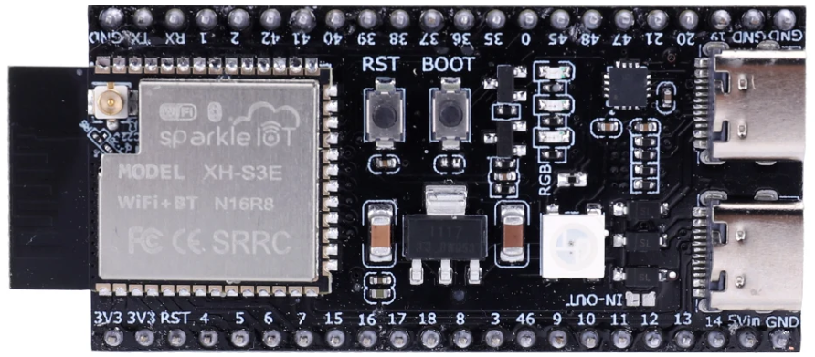
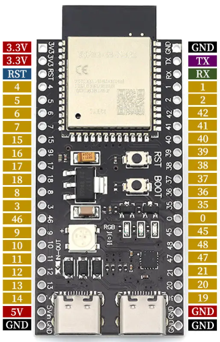

# Svitrix DIY — ESP32-S3-DevKitC-1 Build Guide

> **Estado:** Documento de diseño completo  
> **Fecha:** 2026-06-05  
> **Hardware:** ESP32-S3-DevKitC-1 con módulo N16R8 (16MB Flash, 8MB PSRAM)  
> **Target:** Build DIY simplificado usando placa de desarrollo

---

## Tabla de Contenidos

1. [Resumen del Proyecto](#1-resumen-del-proyecto)
2. [Especificaciones del Sistema](#2-especificaciones-del-sistema)
3. [Bill of Materials (BOM)](#3-bill-of-materials-bom)
4. [Pinout ESP32-S3-DevKitC-1](#4-pinout-esp32-s3-devkitc-1)
5. [Esquemáticos por Subsistema](#5-esquemáticos-por-subsistema)
6. [Cálculos de Potencia](#6-cálculos-de-potencia)
7. [Ensamblaje y Cableado](#7-ensamblaje-y-cableado)
8. [Cambios en el Firmware](#8-cambios-en-el-firmware)
9. [Testing y Validación](#9-testing-y-validación)
10. [Troubleshooting](#10-troubleshooting)
11. [Plan de Trabajo](#11-plan-de-trabajo)
12. [Gabinete 3D Imprimible](#12-gabinete-3d-imprimible)
13. [Apéndice A: Improv WiFi](#apéndice-a-improv-wifi--configuración-sin-access-point)
14. [Apéndice B: Recursos](#apéndice-b-recursos)

---

## 1. Resumen del Proyecto

### 1.1 Objetivo

Construir un reloj/display LED inteligente basado en **ESP32-S3-DevKitC-1** (módulo N16R8) con matriz WS2812B 32×8, compatible con el firmware Svitrix. Diseño DIY simplificado usando placa de desarrollo oficial de Espressif.

### 1.2 Ventajas del DevKitC-1

El **ESP32-S3-DevKitC-1** es la placa de desarrollo oficial de Espressif que incluye:

- Módulo ESP32-S3-WROOM-1 N16R8 integrado
- Regulador de voltaje 5V→3.3V integrado
- USB-C nativo con chip USB-JTAG integrado
- Botones BOOT y RESET integrados
- LED RGB integrado (GPIO48)
- Headers de 2.54mm para fácil prototipado

**Esto elimina la necesidad de:**
- Regulador AMS1117 externo
- Conector USB-C y protección ESD
- Circuito de auto-reset para programación
- Capacitores de bypass adicionales

### 1.3 Características del Proyecto

- Display LED 32×8 (256 LEDs) full color
- WiFi 2.4GHz + Bluetooth 5.0
- Sensores de temperatura/humedad (I2C)
- Sensor de luz ambiente (auto-brillo)
- 4 botones de navegación
- Buzzer para alarmas/notificaciones
- Batería opcional (LiPo 3.7V)
- Integración Home Assistant (MQTT)
- OTA updates
- Web UI completa

### 1.4 Comparativa

| Aspecto | Ulanzi TC001 | DIY DevKitC-1 |
|---------|--------------|---------------|
| MCU | ESP32-WROOM-32D | ESP32-S3-N16R8 |
| Flash | 8 MB (4 MB usados) | 16 MB |
| PSRAM | — | 8 MB |
| LittleFS | 256 KB | ~9.5 MB |
| USB | CH340 externo | Nativo USB-C |
| Complejidad | N/A (comercial) | Baja (DevKit) |
| Costo | ~$50 | ~$30-40 |

---

## 2. Especificaciones del Sistema

### 2.1 DevKitC-1 con módulo N16R8

| Parámetro | Valor |
|-----------|-------|
| Placa | ESP32-S3-DevKitC-1 |
| Módulo | ESP32-S3-WROOM-1 N16R8 |
| CPU | Dual Xtensa LX7 @ 240 MHz |
| Flash | 16 MB (Quad SPI) |
| PSRAM | 8 MB (Octal SPI) |
| SRAM | 512 KB |
| WiFi | 802.11 b/g/n, 2.4 GHz |
| Bluetooth | 5.0 LE |
| GPIO disponibles | ~30 (después de PSRAM/Flash) |
| USB | OTG 1.1 nativo (USB-JTAG integrado) |
| Alimentación | 5V via USB-C |
| Dimensiones | 69.2 × 25.5 mm |

### 2.2 Display: Matriz WS2812B 32×8

| Parámetro | Valor |
|-----------|-------|
| LEDs totales | 256 (32 columnas × 8 filas) |
| Tipo LED | WS2812B-Mini o WS2812B |
| Voltaje | 5V DC |
| Corriente máx | 60mA/LED × 256 = 15.36A teórico |
| Corriente típica | 2-3A @ 50% brillo promedio |
| Protocolo | Single-wire, 800 kHz |
| Refresh rate | 60 FPS |

### 2.3 Diagrama de Bloques

```
┌─────────────────────────────────────────────────────────────────┐
│                     ESP32-S3-DevKitC-1                          │
│  ┌─────────────────────────────────────────────────────────┐    │
│  │  USB-C ──► 5V ──► LDO 3.3V ──► ESP32-S3-N16R8          │    │
│  │    │                              │                      │    │
│  │    │         ┌────────────────────┼──────────────────┐   │    │
│  │    │         │                    │                   │   │    │
│  │    │    GPIO38 ─────────────────────────► LED Matrix 32×8
│  │    │         │                    │       (WS2812B)   │   │    │
│  │    │    GPIO9  ◄── BTN_L          │                   │   │    │
│  │    │    GPIO10 ◄── BTN_SEL        │                   │   │    │
│  │    │    GPIO11 ◄── BTN_R          │                   │   │    │
│  │    │    GPIO12 ◄── BTN_RST        │                   │   │    │
│  │    │         │                    │                   │   │    │
│  │    │    GPIO17 ──► BUZZER         │                   │   │    │
│  │    │         │                    │                   │   │    │
│  │    │    GPIO1  ◄──► I2C SDA ◄──► SHT31/BME280        │   │    │
│  │    │    GPIO2  ◄──► I2C SCL       DS1307 RTC         │   │    │
│  │    │         │                    │                   │   │    │
│  │    │    GPIO4  ◄── LDR            │                   │   │    │
│  │    │    GPIO5  ◄── VBAT (opcional)│                   │   │    │
│  │    │         │                    │                   │   │    │
│  │    └─────────┴────────────────────┴───────────────────┘   │    │
│  └─────────────────────────────────────────────────────────┘    │
└─────────────────────────────────────────────────────────────────┘
```

---

## 3. Bill of Materials (BOM)

### 3.1 Componentes Principales

| # | Componente | Especificación | Cantidad | Precio Est. | Notas |
|---|------------|----------------|----------|-------------|-------|
| 1 | **ESP32-S3-DevKitC-1** | N16R8 (16MB Flash, 8MB PSRAM) | 1 | $8-12 | Espressif oficial |
| 2 | Matriz LED WS2812B 32×8 | Panel flexible o rígido | 1 | $8-15 | 256 LEDs |
| 3 | SHT31 Module | I2C temp/humidity | 1 | $2-4 | Alternativa: BME280 |
| 4 | DS1307 RTC Module | I2C con batería CR2032 | 1 | $1-2 | Opcional pero recomendado |
| 5 | LDR GL5516 | Fotoresistor 5-10kΩ @10lux | 1 | $0.10 | Para auto-brillo |
| 6 | Buzzer pasivo | 3.3V/5V, piezo | 1 | $0.30 | Para alarmas/RTTTL |
| 7 | Tactile buttons | 6×6mm, 4-pin | 4 | $0.40 | Momentary, NO |

### 3.2 Componentes Pasivos

| # | Componente | Valor | Cantidad | Package | Notas |
|---|------------|-------|----------|---------|-------|
| 8 | Resistor | 330Ω | 1 | 0805/THT | Serie con DIN LED |
| 9 | Resistor | 10kΩ | 1 | 0805/THT | Pull-down LDR |
| 10 | Resistor | 4.7kΩ | 2 | 0805/THT | Pull-up I2C (si módulo no los tiene) |
| 11 | Capacitor | 1000µF 10V | 1 | Electrolítico | Bulk para LEDs |

### 3.3 Alimentación Externa (para LEDs)

| # | Componente | Especificación | Cantidad | Notas |
|---|------------|----------------|----------|-------|
| 12 | Fuente 5V/3A | USB-C PD o barrel | 1 | Para matriz LED |
| 13 | Cable dupont | Hembra-Hembra | ~20 | Para conexiones |

### 3.4 Opcionales (Batería)

| # | Componente | Especificación | Cantidad | Notas |
|---|------------|----------------|----------|-------|
| 14 | LiPo Battery | 3.7V, 2000-4400mAh | 1 | Para portabilidad |
| 15 | TP4056 Module | Cargador LiPo USB-C | 1 | Con protección |
| 16 | MT3608 Module | Step-up 5V 2A | 1 | Boost para LEDs desde LiPo |

### 3.5 BOM Resumen de Costos

| Categoría | Costo Estimado |
|-----------|----------------|
| DevKitC-1 | $8-12 |
| Matriz LED | $8-15 |
| Sensores | $3-6 |
| Pasivos + buttons | $2-3 |
| **Total mínimo** | **$21-36** |
| **Con batería** | **$35-50** |

---

## 4. Pinout ESP32-S3-DevKitC-1

### 4.1 Vista del DevKit

**ESP32-S3-DevKitC-1 N16R8** — Placa de desarrollo con módulo WiFi+BT, 16MB Flash, 8MB PSRAM:



### 4.2 Diagrama de Pines



**Pines del proyecto Svitrix:**

| Pin Izquierdo | Función | | Pin Derecho | Función |
|---------------|---------|---|-------------|---------|
| 3V3 | Alimentación | | GND | Tierra |
| 4 | **LDR** (ADC) | | 42 | — |
| 5 | VBAT (opcional) | | 41 | — |
| 17 | **BUZZER** (PWM) | | 38 | **LED DIN** |
| 9 | **BTN_LEFT** | | — | — |
| 10 | **BTN_SELECT** | | — | — |
| 11 | **BTN_RIGHT** | | — | — |
| 12 | **BTN_RESET** | | — | — |
| 5V | Alimentación | | — | — |
| 1 | **I2C SDA** | | — | — |
| 2 | **I2C SCL** | | GND | Tierra |

### 4.3 Tabla de Pines Usados

| GPIO | Función | Dirección | Tipo | Notas |
|------|---------|-----------|------|-------|
| **1** | I2C SDA | I/O | I2C | Pull-up 4.7kΩ externo |
| **2** | I2C SCL | I/O | I2C | Pull-up 4.7kΩ externo |
| **4** | LDR (luz) | Input | ADC1_CH3 | Divisor de voltaje |
| **5** | Batería ADC | Input | ADC1_CH4 | Opcional, divisor 1:2 |
| **9** | Botón LEFT | Input | Digital | Activo LOW, pull-up interno |
| **10** | Botón SELECT | Input | Digital | Activo LOW, wake |
| **11** | Botón RIGHT | Input | Digital | Activo LOW |
| **12** | Botón RESET | Input | Digital | Long-press 5s |
| **17** | Buzzer PWM | Output | LEDC | 2kHz típico |
| **38** | LED Matrix DIN | Output | RMT | 330Ω serie |

### 4.4 Pines NO Disponibles (Reservados en N16R8)

| GPIO | Razón |
|------|-------|
| 0 | Strapping (boot mode) |
| 19, 20 | USB D-/D+ |
| 26-32 | PSRAM Octal |
| 33-37 | Flash Quad SPI |
| 43, 44 | UART0 (console) |
| 45, 46 | Strapping |
| 48 | RGB LED integrado del DevKit |

> **Nota:** GPIO48 está conectado al LED RGB integrado del DevKitC-1. Usamos GPIO38 para la matriz externa.

### 4.5 Pines Libres para Expansión

| GPIO | ADC | Notas |
|------|-----|-------|
| 3 | ADC1_CH2 | Disponible |
| 6 | ADC1_CH5 | Disponible |
| 7 | ADC1_CH6 | Disponible |
| 8 | — | Disponible |
| 13 | ADC2_CH2 | Disponible (no usar con WiFi) |
| 14 | ADC2_CH3 | Disponible (no usar con WiFi) |
| 15, 16, 18 | ADC2 | Disponibles |
| 21, 39-42 | — | Disponibles |

---

## 5. Esquemáticos por Subsistema

### 5.1 Alimentación

El DevKitC-1 maneja la alimentación internamente:

```
┌─────────────────────────────────────────────────────────────┐
│                    POWER (DevKitC-1)                        │
│                                                             │
│   USB-C 5V ──► [Regulador interno] ──► 3.3V (ESP32-S3)     │
│       │                                                     │
│       └──────────────────────────────► 5V pin (para LEDs)  │
│                                                             │
└─────────────────────────────────────────────────────────────┘

IMPORTANTE: La matriz LED necesita alimentación 5V externa separada
si consume más de 500mA. El pin 5V del DevKit está limitado.

Opción A (bajo brillo, <500mA):
   - Usar 5V del DevKit directamente

Opción B (brillo normal, >500mA):
   - Fuente 5V/3A externa conectada directamente a la matriz
   - Compartir GND con DevKit
```

### 5.2 Matriz LED WS2812B

```
                    ┌────────────────────────────────────────────────┐
                    │           LED MATRIX 32×8 WS2812B              │
                    │                                                │
    DevKitC-1       │     R1                                         │
    GPIO38 ─────────┼────[330Ω]────► DIN ─┬─[LED]─┬─[LED]─┬─ ... ─┬─►│
                    │                     │       │       │       │  │
                    │                     └───────┴───────┴───────┘  │
                    │                           Serpentine wiring    │
                    │                                                │
    Fuente 5V/3A ───┼────────────────► VCC ──────────────────────────┤
                    │         │                                      │
                    │    C1   ┴  1000µF/10V                          │
                    │         │  (cerca del primer LED)              │
                    │         │                                      │
    GND (común) ────┼─────────┴──► GND ──────────────────────────────┤
                    │                                                │
                    └────────────────────────────────────────────────┘

IMPORTANTE:
- R1 (330Ω): Protege GPIO38 de reflexiones en línea de datos
- C1 (1000µF): Absorbe picos de corriente
- Conectar GND del DevKit con GND de la fuente externa
- Cable de datos lo más corto posible (<15cm)
```

### 5.3 Botones

```
                    ┌────────────────────────────────────────────┐
                    │              BUTTONS (4×)                   │
                    │                                            │
    DevKitC-1       │     BTN_LEFT                               │
    GPIO9 ──────────┼─────────────────┬────[BTN]────► GND        │
    (pull-up int)   │                 │                          │
                    │                                            │
    GPIO10 ─────────┼─────────────────┬────[BTN]────► GND        │
    (BTN_SELECT)    │     también WAKE desde deep sleep          │
                    │                                            │
    GPIO11 ─────────┼─────────────────┬────[BTN]────► GND        │
    (BTN_RIGHT)     │                                            │
                    │                                            │
    GPIO12 ─────────┼─────────────────┬────[BTN]────► GND        │
    (BTN_RESET)     │     factory reset (5s hold)                │
                    │                                            │
                    └────────────────────────────────────────────┘

Comportamiento:
- LEFT/RIGHT: Navegación, cambio de app
- SELECT corto: Confirmar
- SELECT largo (1s): Menú
- SELECT doble: Toggle power
- RESET (5s): Factory reset
```

### 5.4 Sensor de Luz (LDR)

```
                    ┌────────────────────────────────────────────┐
                    │              LIGHT SENSOR                   │
                    │                                            │
    DevKitC-1 3.3V ─┼────────────┬───────────────────────────────┤
                    │            │                                │
                    │       ┌────┴────┐                           │
                    │       │   LDR   │  GL5516                   │
                    │       │ 5k-500k │  (5kΩ@10lux)              │
                    │       └────┬────┘                           │
                    │            │                                │
    GPIO4 (ADC) ────┼────────────┤                                │
                    │            │                                │
                    │       ┌────┴────┐                           │
                    │       │  10kΩ   │  R2 - Pull-down           │
                    │       └────┬────┘                           │
                    │            │                                │
    GND ────────────┼────────────┴───────────────────────────────┤
                    │                                            │
                    └────────────────────────────────────────────┘
```

### 5.5 Sensores I2C

```
                    ┌────────────────────────────────────────────────────┐
                    │                  I2C BUS                            │
                    │                                                     │
    DevKitC-1 3.3V ─┼───────┬─────────────────┬───────────────────────────┤
                    │       │                 │                           │
                    │  R3   │ 4.7kΩ      R4   │ 4.7kΩ                     │
                    │  ┌────┴────┐       ┌────┴────┐                      │
                    │  └────┬────┘       └────┬────┘                      │
                    │       │                 │                           │
                    │       │                 │       ┌─────────────────┐ │
    GPIO1 (SDA) ────┼───────┴─────────────────┼──────►│ SHT31 / BME280  │ │
                    │                         │       │   Addr: 0x44    │ │
    GPIO2 (SCL) ────┼─────────────────────────┴──────►│   or 0x76/0x77  │ │
                    │                                 └─────────┬───────┘ │
                    │                                           │         │
                    │                                 ┌─────────┴───────┐ │
                    │                        ────────►│ DS1307 RTC      │ │
                    │                                 │   Addr: 0x68    │ │
                    │                        ────────►│   + CR2032      │ │
                    │                                 └─────────┬───────┘ │
                    │                                           │         │
    GND ────────────┼───────────────────────────────────────────┴────────┤
                    │                                                     │
                    └────────────────────────────────────────────────────┘

Nota: Muchos módulos I2C ya incluyen pull-ups. Verificar antes de agregar.
```

### 5.6 Buzzer

```
                    ┌────────────────────────────────────────────┐
                    │              BUZZER (Passive)               │
                    │                                            │
    DevKitC-1       │                                            │
    GPIO17 (PWM) ───┼───────────────────► (+) ┌──────────┐       │
                    │                         │  BUZZER  │       │
    GND ────────────┼───────────────────► (-) │ Passive  │       │
                    │                         │  3.3V    │       │
                    │                         └──────────┘       │
                    │                                            │
                    └────────────────────────────────────────────┘

Nota: Usar buzzer pasivo de 3.3V. Si solo tienes de 5V,
agregar transistor NPN como amplificador.
```

---

## 6. Cálculos de Potencia

### 6.1 Consumo por Componente

| Componente | Voltaje | Corriente Típica | Corriente Máxima |
|------------|---------|------------------|------------------|
| ESP32-S3 (WiFi activo) | 3.3V | 80-160mA | 350mA |
| LED Matrix (25% brillo) | 5V | 400mA | — |
| LED Matrix (50% brillo) | 5V | 800mA | — |
| LED Matrix (100% blanco) | 5V | — | 15A |
| Sensores I2C | 3.3V | <1mA | 2mA |
| LDR circuit | 3.3V | <0.5mA | — |
| Buzzer | 3.3V | — | 30mA |

### 6.2 Fuentes de Alimentación

| Escenario | Consumo Total | Fuente Recomendada |
|-----------|---------------|---------------------|
| Solo DevKit (testing) | ~200mA @ 5V | USB PC |
| + LEDs bajo brillo | ~600mA @ 5V | USB 1A |
| + LEDs brillo normal | ~1.2A @ 5V | USB 2A / Fuente 5V/2A |
| + LEDs brillo alto | ~2A @ 5V | Fuente 5V/3A |

**Recomendación:** Fuente externa 5V/3A para la matriz, USB para el DevKit.

---

## 7. Ensamblaje y Cableado

### 7.1 Diagrama de Cableado Completo

```
┌─────────────────────────────────────────────────────────────────────────────┐
│                           COMPLETE WIRING DIAGRAM                            │
│                                                                             │
│                                                                             │
│    ┌─────────────────────────────────────────────────────────────────────┐  │
│    │                    ESP32-S3-DevKitC-1                                │  │
│    │                                                                     │  │
│    │  USB-C ◄──► PC (programación) o Fuente 5V                           │  │
│    │                                                                     │  │
│    │  5V pin ─────────┬──────────────────────────────────────────────────┤  │
│    │                  │  (para matriz si <500mA)                         │  │
│    │                  │                                                  │  │
│    │  GND ────────────┼──────────────────────────────────────────────────┤  │
│    │                  │                                                  │  │
│    │  GPIO38 ─────────┼──[330Ω]──► LED Matrix DIN                        │  │
│    │                  │                                                  │  │
│    │  GPIO9 ──────────┼──────────[BTN_L]──► GND                          │  │
│    │  GPIO10 ─────────┼──────────[BTN_S]──► GND                          │  │
│    │  GPIO11 ─────────┼──────────[BTN_R]──► GND                          │  │
│    │  GPIO12 ─────────┼──────────[BTN_X]──► GND                          │  │
│    │                  │                                                  │  │
│    │  GPIO17 ─────────┼──────────► Buzzer (+)                            │  │
│    │  GND ────────────┼──────────► Buzzer (-)                            │  │
│    │                  │                                                  │  │
│    │  GPIO1 ──────────┼──────────► I2C SDA ──► SHT31, DS1307             │  │
│    │  GPIO2 ──────────┼──────────► I2C SCL ──► SHT31, DS1307             │  │
│    │  3.3V ───────────┼──[4.7kΩ]─┬─► SDA                                 │  │
│    │  3.3V ───────────┼──[4.7kΩ]─┴─► SCL                                 │  │
│    │                  │                                                  │  │
│    │  GPIO4 ──────────┼────┬─────► LDR ──► 3.3V                          │  │
│    │  GND ────────────┼──[10kΩ]──┘                                       │  │
│    │                  │                                                  │  │
│    └──────────────────┼──────────────────────────────────────────────────┘  │
│                       │                                                     │
│    ┌──────────────────┼──────────────────────────────────────────────────┐  │
│    │  LED MATRIX      │                                                  │  │
│    │                  │                                                  │  │
│    │  DIN ◄───────────┘                                                  │  │
│    │  VCC ◄─────────────────────────────── Fuente 5V/3A (+)              │  │
│    │  GND ◄─────────────────────────────── Fuente 5V/3A (-) ◄── DevKit GND
│    │      │                                                              │  │
│    │  [1000µF] entre VCC y GND, cerca del primer LED                     │  │
│    │                                                                     │  │
│    └─────────────────────────────────────────────────────────────────────┘  │
│                                                                             │
└─────────────────────────────────────────────────────────────────────────────┘
```

### 7.2 Orden de Ensamblaje

```
PASO 1: Verificar DevKit
├── Conectar USB al PC
├── Verificar LED RGB integrado enciende
└── Verificar puerto COM detectado

PASO 2: Flash firmware de prueba
├── pio run -e esp32s3 -t upload
├── Verificar serial output
└── Test básico WiFi AP mode

PASO 3: Conectar botones (sin LEDs)
├── Conectar 4 botones a GPIOs
├── Verificar en serial log
└── Test cada botón individualmente

PASO 4: Conectar sensores I2C
├── Conectar SHT31 / BME280
├── Conectar DS1307 RTC
├── Agregar pull-ups si necesario
└── Verificar I2C scan en serial

PASO 5: Conectar LDR
├── Montar divisor de voltaje
├── Verificar lectura ADC varía con luz
└── Calibrar en firmware si necesario

PASO 6: Conectar buzzer
├── Conectar buzzer pasivo
├── Test de melodía RTTTL
└── Verificar volumen

PASO 7: Conectar matriz LED (último)
├── Preparar fuente 5V externa si necesario
├── Conectar GND común
├── Conectar DIN via resistor 330Ω
├── Agregar capacitor 1000µF
├── Encender con brillo bajo primero (10%)
└── Test patrón de colores

PASO 8: Test completo
├── Todas las apps nativas
├── WiFi + Web UI
├── MQTT / Home Assistant
├── OTA update
└── Deep sleep / wake
```

---

## 8. Cambios en el Firmware

### 8.1 Archivos a Modificar

| Archivo | Acción | Descripción |
|---------|--------|-------------|
| `src/HardwarePins.h` | **Crear** | Abstracción de pines |
| `svitrix_s3_partition.csv` | **Crear** | Tabla de particiones 16MB |
| `platformio.ini` | Modificar | Agregar `[env:esp32s3]` |

### 8.2 HardwarePins.h

```cpp
#pragma once

#include <driver/gpio.h>

#if defined(CONFIG_IDF_TARGET_ESP32S3)
// ───────────────────────────────────────────────────────────────────────────
// ESP32-S3-DevKitC-1 (N16R8)
// ───────────────────────────────────────────────────────────────────────────
namespace HW {
    // LED Matrix (WS2812B 32×8)
    constexpr int kMatrixPin = 38;          // GPIO38 (no GPIO48 - usado por LED RGB)
    constexpr int kMatrixWidth = 32;
    constexpr int kMatrixHeight = 8;
    constexpr int kNumLeds = 256;

    // Navigation Buttons (active LOW, internal pull-up)
    constexpr int kButtonLeftPin   = 9;
    constexpr int kButtonSelectPin = 10;    // Also deep sleep wake
    constexpr int kButtonRightPin  = 11;
    constexpr int kButtonResetPin  = 12;    // Factory reset (5s hold)

    // Audio (passive piezo buzzer, PWM)
    constexpr int kBuzzerPin = 17;
    constexpr int kBuzzerChannel = 0;

    // I2C Bus
    constexpr int kI2cSdaPin = 1;
    constexpr int kI2cSclPin = 2;
    constexpr uint32_t kI2cFreq = 400000;

    // Analog Inputs (ADC1 only)
    constexpr int kLdrPin = 4;              // ADC1_CH3
    constexpr int kBatteryPin = 5;          // ADC1_CH4 (opcional)

    // Deep Sleep Wake
    constexpr gpio_num_t kWakeupPin = GPIO_NUM_10;

    // Hardware Feature Flags
    constexpr bool kHasBattery = false;
    constexpr bool kHasLdr = true;
    constexpr bool kHasPsram = true;
    constexpr bool kHasNativeUsb = true;
}

#elif defined(CONFIG_IDF_TARGET_ESP32)
// ───────────────────────────────────────────────────────────────────────────
// ESP32 Classic (Ulanzi TC001)
// ───────────────────────────────────────────────────────────────────────────
namespace HW {
    constexpr int kMatrixPin = 32;
    constexpr int kMatrixWidth = 32;
    constexpr int kMatrixHeight = 8;
    constexpr int kNumLeds = 256;

    constexpr int kButtonLeftPin   = 26;
    constexpr int kButtonSelectPin = 27;
    constexpr int kButtonRightPin  = 14;
    constexpr int kButtonResetPin  = 13;

    constexpr int kBuzzerPin = 15;
    constexpr int kBuzzerChannel = 0;

    constexpr int kI2cSdaPin = 21;
    constexpr int kI2cSclPin = 22;
    constexpr uint32_t kI2cFreq = 400000;

    constexpr int kLdrPin = 35;
    constexpr int kBatteryPin = 34;

    constexpr gpio_num_t kWakeupPin = GPIO_NUM_27;

    constexpr bool kHasBattery = true;
    constexpr bool kHasLdr = true;
    constexpr bool kHasPsram = false;
    constexpr bool kHasNativeUsb = false;
}

#else
    #error "Unsupported target"
#endif
```

### 8.3 platformio.ini

```ini
[env:esp32s3]
platform = espressif32@6.3.0
framework = arduino
board = esp32-s3-devkitc-1

; Flash/PSRAM Configuration
board_build.flash_mode = qio
board_build.flash_size = 16MB
board_build.partitions = svitrix_s3_partition.csv
board_build.filesystem = littlefs
board_build.arduino.memory_type = qio_opi

; USB CDC
build_flags = 
    ${env:ulanzi.build_flags}
    -DBOARD_HAS_PSRAM
    -DARDUINO_USB_MODE=1
    -DARDUINO_USB_CDC_ON_BOOT=1

monitor_speed = 115200
upload_speed = 921600

lib_deps = ${env:ulanzi.lib_deps}
```

### 8.4 svitrix_s3_partition.csv

```csv
# Svitrix ESP32-S3 N16R8 Partition Table (16MB Flash)
# Name,     Type, SubType,  Offset,    Size,      Flags
nvs,        data, nvs,      0x9000,    0x5000,
otadata,    data, ota,      0xe000,    0x2000,
app0,       app,  ota_0,    0x10000,   0x300000,
app1,       app,  ota_1,    0x310000,  0x300000,
spiffs,     data, spiffs,   0x610000,  0x9F0000,
```

---

## 9. Testing y Validación

### 9.1 Checklist

```
HARDWARE
[ ] DevKit detectado por PC (USB)
[ ] 3.3V OK en pines 3V3
[ ] Botones: todos responden
[ ] I2C: scan detecta sensores
[ ] LDR: ADC varía con luz
[ ] Buzzer: suena
[ ] LEDs: 256 encienden, colores correctos

FIRMWARE
[ ] Boot OK (serial log)
[ ] WiFi AP mode
[ ] WiFi STA connection
[ ] Web UI accesible
[ ] Clock muestra hora
[ ] Sensores muestran valores
[ ] MQTT conecta
[ ] HA discovery
[ ] OTA funciona
```

### 9.2 Comandos

```bash
# Build
pio run -e esp32s3

# Flash
pio run -e esp32s3 -t upload

# Monitor
pio device monitor -e esp32s3

# Size check
pio run -e esp32s3 -t size
```

---

## 10. Troubleshooting

| Síntoma | Causa | Solución |
|---------|-------|----------|
| No arranca | GPIO0 a GND | Liberar GPIO0 |
| USB no detectado | Cable solo carga | Usar cable de datos |
| LEDs no encienden | DIN sin resistor | Agregar 330Ω |
| LEDs flickering | Sin capacitor | Agregar 1000µF |
| Colores incorrectos | Orden GRB/RGB | Verificar tipo LED |
| WiFi débil | Interferencia | Alejar de fuente 5V |
| I2C no detecta | Sin pull-ups | Agregar 4.7kΩ |
| ADC lee 0 | GPIO incorrecto | Usar solo ADC1 |

---

## 11. Plan de Trabajo

### Fase 1: Hardware (1 día)

| Tarea | Verificación |
|-------|--------------|
| Obtener DevKitC-1 + componentes | BOM completo |
| Probar DevKit solo | Serial output OK |
| Conectar periféricos | Todos responden |

### Fase 2: Firmware (1 día)

| Tarea | Verificación |
|-------|--------------|
| Crear branch `feat/esp32s3` | — |
| Crear HardwarePins.h | Compila ambos targets |
| Crear partition table | — |
| Agregar env a platformio.ini | Build OK |

### Fase 3: Testing (1 día)

| Tarea | Verificación |
|-------|--------------|
| Test completo de hardware | Checklist OK |
| Test WiFi + Web UI | Acceso completo |
| Test MQTT/HA | Integración OK |
| Test OTA | Update funciona |

---

## 12. Gabinete 3D Imprimible

Diseño minimalista para impresión 3D que aloja la matriz LED 32×8 WS2812B estándar y el DevKitC-1.

### 12.1 Dimensiones de Paneles WS2812B Comunes

| Tipo | Pitch | Dimensiones Panel | Dimensiones Gabinete |
|------|-------|-------------------|----------------------|
| **WS2812B estándar (5050)** | 10mm | 320 × 80 mm | 340 × 100 × 25 mm |
| **WS2812B rígido** | 8mm | 256 × 64 mm | 276 × 84 × 25 mm |
| **WS2812B-Mini** | 5mm | 160 × 40 mm | 180 × 60 × 20 mm |

### 12.2 Diseño del Gabinete (Panel 10mm - 320×80mm)

```
┌─────────────────────────────────────────────────────────────────────────────┐
│                           VISTA FRONTAL                                      │
│                                                                             │
│    ┌─────────────────────────────────────────────────────────────────────┐  │
│    │░░░░░░░░░░░░░░░░░░░░░░░░░░░░░░░░░░░░░░░░░░░░░░░░░░░░░░░░░░░░░░░░░░░░│  │
│    │░░░░░░░░░░░░░░░░░░░░░░░░░░░░░░░░░░░░░░░░░░░░░░░░░░░░░░░░░░░░░░░░░░░░│  │
│    │░░░░░░░░░░░░░░░░░░  VENTANA DIFUSOR  ░░░░░░░░░░░░░░░░░░░░░░░░░░░░░░░│  │
│    │░░░░░░░░░░░░░░░░░░░░░░░░░░░░░░░░░░░░░░░░░░░░░░░░░░░░░░░░░░░░░░░░░░░░│  │
│    │░░░░░░░░░░░░░░░░░░░░░░░░░░░░░░░░░░░░░░░░░░░░░░░░░░░░░░░░░░░░░░░░░░░░│  │
│    └─────────────────────────────────────────────────────────────────────┘  │
│    │◄──────────────────────── 340 mm ────────────────────────────────►│     │
│                                                                             │
└─────────────────────────────────────────────────────────────────────────────┘

┌─────────────────────────────────────────────────────────────────────────────┐
│                           VISTA SUPERIOR                                     │
│                                                                             │
│    ┌─────────────────────────────────────────────────────────────────────┐  │
│    │                                                                     │  │
│    │   [○ LDR]                              [USB-C]                      │  │
│    │                                                                     │  │
│    └─────────────────────────────────────────────────────────────────────┘  │
│    │◄───────────────────────── 340 mm ───────────────────────────────►│     │
│    ▲                                                                        │
│   25mm                                                                      │
│    ▼                                                                        │
└─────────────────────────────────────────────────────────────────────────────┘

┌─────────────────────────────────────────────────────────────────────────────┐
│                           VISTA LATERAL                                      │
│                                                                             │
│         ┌──────────────────────────────────────────────┐                    │
│         │░░░░░░░░░░░░░░░░░░░░░░░░░░░░░░░░░░░░░░░░░░░░░░│ ◄── Difusor       │
│         │                                              │                    │
│         │   ┌────────────────────────────────────┐     │ ◄── Panel LED     │
│         │   │  ○ ○ ○ ○ ○ ○ ○ ○  (32 LEDs row)   │     │                    │
│         │   └────────────────────────────────────┘     │                    │
│         │                                              │                    │
│         │   ┌─────────────┐                            │ ◄── DevKitC-1     │
│         │   │  ESP32-S3   │   [SHT31] [DS1307]         │                    │
│         │   │  DevKitC-1  │                            │                    │
│         │   └─────────────┘                            │                    │
│         │      [BUZZER]                                │                    │
│         └──────────────────────────────────────────────┘                    │
│         │◄─────────────── 100 mm ─────────────────────►│                    │
│         ▲                                                                   │
│        25mm                                                                 │
│         ▼                                                                   │
└─────────────────────────────────────────────────────────────────────────────┘

┌─────────────────────────────────────────────────────────────────────────────┐
│                           VISTA TRASERA                                      │
│                                                                             │
│    ┌─────────────────────────────────────────────────────────────────────┐  │
│    │                                                                     │  │
│    │  [BTN_L] [BTN_S] [BTN_R] [BTN_X]          [VENT]  [VENT]  [USB-C]   │  │
│    │                                                                     │  │
│    │  ════════════════════════════════════════════════════════════════   │  │
│    │                         (ranuras ventilación)                       │  │
│    │                                                                     │  │
│    └─────────────────────────────────────────────────────────────────────┘  │
│                                                                             │
└─────────────────────────────────────────────────────────────────────────────┘
```

### 12.3 Archivo OpenSCAD

> **Descargar:** [`hardware/enclosure.scad`](../hardware/enclosure.scad)  
> **Visualización:** [`hardware/enclosure_preview.txt`](../hardware/enclosure_preview.txt)

**Parámetros principales (editables en el archivo):**

```openscad
// Panel LED
led_pitch      = 10;        // mm entre LEDs (5, 8, o 10)
led_cols       = 32;        // columnas
led_rows       = 8;         // filas

// Gabinete
wall           = 2;         // grosor de pared
depth          = 25;        // profundidad interna

// Componentes
btn_d          = 6.5;       // diámetro agujero botón
btn_spacing    = 15;        // espacio entre botones
ldr_d          = 5;         // diámetro agujero LDR
usb_w          = 10;        // ancho puerto USB-C
```

**Módulos disponibles:**
- `enclosure_bottom()` — Base con soportes para LED y DevKit
- `enclosure_top()` — Tapa con ventana para difusor
- `diffuser()` — Lámina difusora opcional

**Para generar STL:**
1. Instalar [OpenSCAD](https://openscad.org/downloads.html)
2. Abrir `hardware/enclosure.scad`
3. Descomentar el módulo deseado
4. Presionar F6 (render)
5. File → Export → Export as STL

### 12.4 Variante Compacta (Panel 8mm - 256×64mm)

Para paneles de pitch 8mm, cambiar estos parámetros:

```openscad
led_pitch      = 8;         // 8mm pitch
panel_width    = 256;       // 32 × 8mm
panel_height   = 64;        // 8 × 8mm
depth          = 22;        // menos profundidad
```

**Dimensiones resultantes:** 276 × 84 × 24 mm

### 12.5 Lista de Materiales para Impresión

| Componente | Material | Color | Cantidad |
|------------|----------|-------|----------|
| Base (enclosure_bottom) | PLA/PETG | Negro/Gris | 1 |
| Tapa (enclosure_top) | PLA blanco | Blanco | 1 |
| Difusor (opcional) | Acrílico opalino | Blanco | 1 |
| Tornillos M3×8 | — | — | 4 |
| Tuercas M3 | — | — | 4 |

### 12.6 Configuración de Impresión Recomendada

| Parámetro | Valor |
|-----------|-------|
| **Altura de capa** | 0.2mm |
| **Perímetros** | 3 |
| **Relleno** | 20% |
| **Patrón relleno** | Grid o Gyroid |
| **Soportes** | No necesarios |
| **Brim** | 5mm (recomendado) |
| **Temperatura** | PLA: 200°C / PETG: 235°C |
| **Cama** | PLA: 60°C / PETG: 80°C |

### 12.7 Ensamblaje del Gabinete

```
PASO 1: Imprimir piezas
├── Imprimir base (boca arriba)
├── Imprimir tapa (boca abajo para superficie lisa)
└── Limpiar rebabas

PASO 2: Instalar electrónica
├── Colocar DevKitC-1 en soporte
├── Conectar cables a sensores
├── Montar sensores I2C en lateral
├── Instalar LDR en agujero superior
├── Instalar botones en agujeros traseros
└── Conectar buzzer

PASO 3: Instalar panel LED
├── Colocar panel en soportes (LEDs hacia arriba)
├── Conectar cable de datos
├── Conectar alimentación
└── Verificar orientación (DIN en esquina correcta)

PASO 4: Cerrar gabinete
├── Colocar difusor (si aplica)
├── Encajar tapa en base
├── Asegurar con tornillos M3 (opcional)
└── Test final
```

### 12.8 Alternativas de Difusor

| Opción | Ventajas | Desventajas |
|--------|----------|-------------|
| **Tapa impresa en PLA blanco** | Simple, integrado | Menos difusión |
| **Acrílico opalino 2mm** | Excelente difusión | Requiere corte |
| **Papel vegetal** | Muy barato | Frágil |
| **Film difusor LED** | Profesional | Más caro |

---

## Apéndice A: Improv WiFi — Configuración Sin Access Point

### A.1 Resumen

[Improv WiFi](https://www.improv-wifi.com/) es un estándar abierto para configurar WiFi en dispositivos IoT **sin necesidad de crear un Access Point**. El usuario envía las credenciales WiFi via Bluetooth LE o Serial USB directamente desde el navegador.

**Flujo de configuración:**
1. Usuario abre web (Chrome/Edge) → conecta via BLE o Serial
2. Envía credenciales WiFi al dispositivo
3. Dispositivo se conecta y devuelve URL de configuración
4. Usuario accede a la Web UI normalmente

### A.2 ¿Por qué en ESP32-S3?

| Aspecto | ESP32 (TC001) | ESP32-S3 (DIY) |
|---------|---------------|----------------|
| Partición OTA | 1.8 MB | **3 MB** |
| Firmware actual | ~1.3 MB | ~1.3 MB |
| Espacio libre | ~500 KB | **~1.7 MB** |
| Bluetooth | Classic + BLE | **BLE 5.0 nativo** |
| Stack BLE (NimBLE) | +100-170 KB | +100-170 KB |
| **Viabilidad** | ⚠️ Ajustado | ✅ **Sin problema** |

El ESP32-S3 tiene espacio de sobra y BLE 5.0 optimizado — Improv BLE es viable sin compromisos.

### A.3 Consumo de Memoria BLE

| Stack | Flash | RAM | Notas |
|-------|-------|-----|-------|
| **Bluedroid** | ~250-400 KB | ~60-80 KB | BT Classic + BLE, pesado |
| **NimBLE** (recomendado) | ~100-170 KB | ~30-40 KB | Solo BLE, ligero |

**NimBLE ahorra ~170 KB flash y ~30-40 KB RAM** vs Bluedroid.

### A.4 Opciones de Implementación

| Opción | Flash Extra | Complejidad | Caso de Uso |
|--------|-------------|-------------|-------------|
| **Improv Serial** | ~5-10 KB | Baja | Flasher web, configuración inicial via USB |
| **Improv BLE** | ~100-170 KB | Media | Configuración inalámbrica post-instalación |
| **Ambos** | ~110-180 KB | Media | Máxima flexibilidad |

### A.5 Integración con Flasher Web

El [flasher web](../web/flasher/) ya usa Web Serial para flashear el firmware. Añadir Improv Serial permitiría:

```
┌─────────────────────────────────────────────────────────────────┐
│                    FLASHER WEB + IMPROV                          │
│                                                                 │
│  1. Usuario conecta USB                                         │
│  2. Flashea firmware via Web Serial (ESP Web Tools)             │
│  3. Sin desconectar, configura WiFi via Improv Serial           │
│  4. Dispositivo se conecta y muestra URL de Web UI              │
│  5. Usuario accede a la configuración completa                  │
│                                                                 │
│  ✅ Sin cambiar de red WiFi                                     │
│  ✅ Sin buscar IP del dispositivo                               │
│  ✅ Experiencia fluida de principio a fin                       │
└─────────────────────────────────────────────────────────────────┘
```

### A.6 Librerías Recomendadas

| Librería | Protocolo | Repo |
|----------|-----------|------|
| **ImprovWiFiLibrary** | Serial | [github.com/jnthas/Improv-WiFi-Library](https://github.com/jnthas/Improv-WiFi-Library) |
| **esp-nimble-cpp** | BLE | [github.com/h2zero/esp-nimble-cpp](https://github.com/h2zero/esp-nimble-cpp) |
| **Improv BLE (ESPHome)** | BLE | Referencia en [esphome.io/components/esp32_improv](https://esphome.io/components/esp32_improv.html) |

### A.7 Plan de Implementación

**Fase 1: Improv Serial (prioridad alta)**
- [ ] Integrar `ImprovWiFiLibrary` en `ServerManager`
- [ ] Habilitar durante modo AP o si no hay WiFi configurado
- [ ] Actualizar flasher web para enviar credenciales post-flash
- [ ] Retornar URL `http://<ip>/` tras conexión exitosa

**Fase 2: Improv BLE (prioridad media)**
- [ ] Agregar `esp-nimble-cpp` a `lib_deps`
- [ ] Crear `ImprovBleManager` con servicio GATT
- [ ] Habilitar BLE solo durante configuración inicial (ahorra RAM)
- [ ] Deshabilitar BLE tras conexión WiFi exitosa
- [ ] Agregar flag `HW::kHasImprovBle` en `HardwarePins.h`

**Fase 3: Integración Home Assistant**
- Improv es el estándar de ESPHome/HA — dispositivos con Improv aparecen automáticamente en HA durante onboarding

### A.8 Ejemplo de Código (Improv Serial)

```cpp
#include <ImprovWiFiLibrary.h>

ImprovWiFi improvSerial(&Serial);

void setup() {
    Serial.begin(115200);
    
    improvSerial.setDeviceInfo(
        ImprovTypes::ChipFamily::CF_ESP32_S3,
        "Svitrix",
        VERSION,
        "Svitrix DIY"
    );
    
    improvSerial.onImprovConnected([](const char* ssid, const char* password) {
        // Guardar credenciales y conectar
        WiFi.begin(ssid, password);
    });
    
    improvSerial.onImprovConnectedCallback([](const char* url) {
        // Retornar URL de la Web UI
        return String("http://") + WiFi.localIP().toString() + "/";
    });
}

void loop() {
    improvSerial.handleSerial();
    // ... resto del loop
}
```

### A.9 Referencias

- [Improv WiFi Specification](https://www.improv-wifi.com/)
- [ESP32 BLE NimBLE vs Bluedroid](https://www.esp32.com/viewtopic.php?t=16094)
- [NimBLE Flash/RAM Savings](https://h2zero.github.io/esp-nimble-cpp/)
- [ESPHome Improv Serial](https://esphome.io/components/improv_serial.html)
- [ESPHome ESP32 Improv BLE](https://esphome.io/components/esp32_improv.html)

---

## Apéndice B: Recursos

- [ESP32-S3-DevKitC-1 Docs](https://docs.espressif.com/projects/esp-idf/en/latest/esp32s3/hw-reference/esp32s3/user-guide-devkitc-1.html)
- [ESP32-S3 Datasheet](https://www.espressif.com/sites/default/files/documentation/esp32-s3_datasheet_en.pdf)
- [PlatformIO ESP32-S3](https://docs.platformio.org/en/latest/boards/espressif32/esp32-s3-devkitc-1.html)
- [OpenSCAD](https://openscad.org/) — Software para diseño 3D paramétrico

---

*Documento: Svitrix DIY ESP32-S3-DevKitC-1 Build Guide*  
*Versión: 3.2 (+ Improv WiFi)*  
*Fecha: 2026-06-07*
