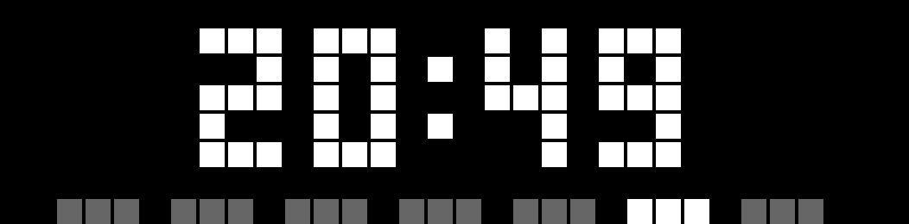
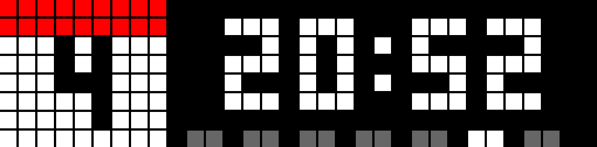
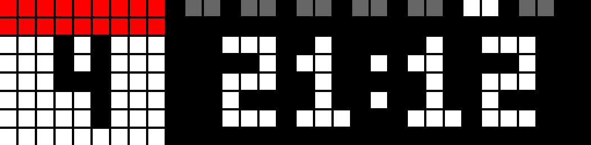
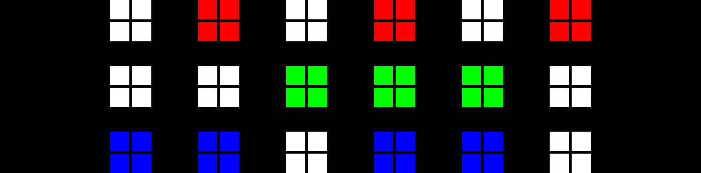
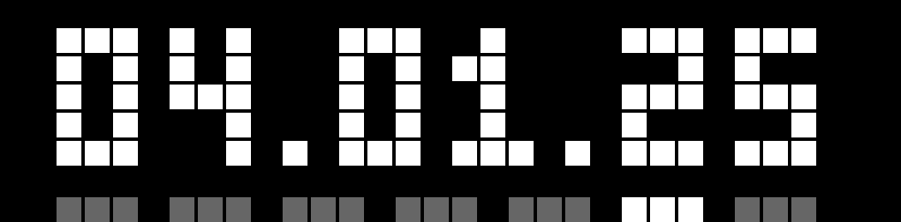
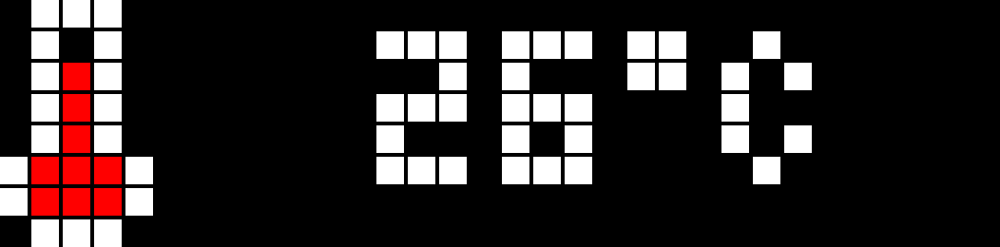
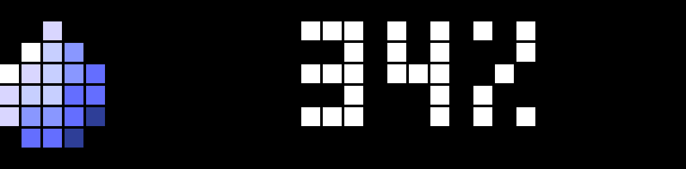
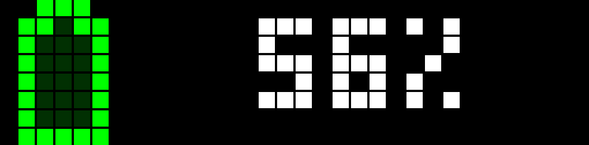

# Вбудовані застосунки
## Time
Вбудований застосунок Time пропонує широкі можливості налаштування. Майже все можна налаштувати через API, а більшість параметрів також можна змінити через застосунок SVITRIX3.
Формат часу можна налаштувати відповідно до ваших уподобань. За замовчуванням встановлено `HH:mm`.
Якщо обраний формат не вміщується на екрані, він автоматично повернеться до формату за замовчуванням.
Ви можете помітити кілька ліній внизу екрана. Ці лінії позначають дні тижня, а поточний день підсвічується яскравіше. Також можна вимкнути цю панель днів тижня.
Ви також можете налаштувати кольори іконки календаря, панелі днів тижня та кольору тексту за допомогою [SettingsAPI](./api#change-settings) або мобільного застосунку.

Параметр `TMODE` визначає макет і стиль застосунку Time.

 **TMODE=0**

Відображає час разом із панеллю днів тижня внизу екрана.

**TMODE=1**

Показує час із панеллю днів тижня внизу та блоком календаря, який виділяє поточний день місяця.

**TMODE=2**

Аналогічно до `TMODE=1`, але панель днів тижня розміщується вгорі.

**TMODE=3**

Відображає час із панеллю днів тижня внизу та іншою іконкою календаря.

**TMODE=4**

Аналогічно до `TMODE=3`, але панель днів тижня розміщується вгорі.

**TMODE=5**

Режим "великого часу", що використовує великий шрифт для відображення часу.
Якщо у кореневому каталозі є GIF-файл 32x8 з назвою `bigtime.gif`, він буде програватися на фоні.
Зверніть увагу: коли GIF відображається в режимі BigTime, його неможливо безпосередньо замінити, оскільки файл використовується.
Щоб замінити іконку, спочатку переключіть режим на TMODE, і тоді ви зможете оновити GIF.
Якщо GIF не знайдено, використовується глобальний колір тексту.

[Тут можна знайти приклади GIF-файлів для bigtime](https://github.com/svitrix/svitrix-firmware/tree/main/docs/assets/bigtime-gifs).

**TMODE=6**

Відображає час у **двійковому форматі**:
Верхній рядок показує години, середній рядок — хвилини, а нижній рядок — секунди.
Кожен рядок має шість точок, де засвічені точки означають двійкову "1", а білі точки — двійковий "0".
Щоб прочитати час, перетворіть засвічені точки в кожному рядку на десяткове число.

#### **Доступні формати часу:**
| Format       | Example    | Description                                |
|--------------|------------|--------------------------------------------|
| `%H:%M:%S`   | `13:30:45` | 24-hour time with seconds                 |
| `%l:%M:%S`   | `1:30:45`  | 12-hour time with seconds                 |
| `%H:%M`      | `13:30`    | 24-hour time                              |
| `%H %M`      | `13.30`    | 24-hour time with blinking colon          |
| `%l:%M`      | `1:30`     | 12-hour time                              |
| `%l %M`      | `1:30`     | 12-hour time with blinking colon          |
| `%l:%M %p`   | `1:30 PM`  | 12-hour time with AM/PM indicator         |
| `%l %M %p`   | `1:30 PM`  | 12-hour time with blinking colon and AM/PM|

---
## Date

Застосунок Date показує поточну дату. Є кілька форматів дати 'DFORMAT', які можна обрати:

#### **Доступні формати дати:**
| Format       | Example    | Description            |
|--------------|------------|------------------------|
| `%d.%m.%y`   | `16.04.22` | Day.Month.Year (short) |
| `%d.%m`      | `16.04`    | Day.Month             |
| `%y-%m-%d`   | `22-04-16` | Year-Month-Day         |
| `%m-%d`      | `04-16`    | Month-Day             |
| `%m/%d/%y`   | `04/16/22` | Month/Day/Year         |
| `%m/%d`      | `04/16`    | Month/Day             |
| `%d/%m/%y`   | `16/04/22` | Day/Month/Year         |
| `%d/%m`      | `16/04`    | Day/Month             |
| `%m-%d-%y`   | `04-16-22` | Month-Day-Year         |

---
## Temperature

Застосунок Temperature відображає поточні показання вбудованого датчика температури.
Однак, через розташування датчика всередині корпусу, вимірювання можуть бути не зовсім точними.
На показання температури можуть впливати такі фактори, як плата живлення, LED-матриця, яскравість, колір та кількість засвічених пікселів.
Для точнішого вимірювання можна використати [dev.json](./dev) для калібрування температури за допомогою ключа `temp_offset`.

---
## Humidity

Застосунок Humidity відображає поточні показання вбудованого датчика вологості.
Однак, через розташування датчика всередині корпусу, вимірювання можуть бути не зовсім точними.
На показання вологості можуть впливати такі фактори, як плата живлення, LED-матриця, яскравість, колір та кількість засвічених пікселів.
Для точнішого вимірювання можна використати [dev.json](./dev) для калібрування вологості за допомогою ключа `hum_offset`.

---
## Battery

Застосунок Battery відображає поточний рівень заряду вбудованого акумулятора.
Через відмінності між партіями акумуляторів та деградацію недорогого акумулятора з часом може знадобитися ручне калібрування.

1. Використовуйте [Status API](./api#status-retrieval) для отримання показань `bat_raw`.
2. Відкрийте файл [dev.json](./dev) для налаштування значень `min_battery` та `max_battery`:
   - **`min_battery`**: Введіть значення `bat_raw`, коли акумулятор розряджений.
   - **`max_battery`**: Введіть значення `bat_raw`, коли акумулятор повністю заряджений.

---
# Custom Apps

Окрім вбудованих застосунків, SVITRIX розроблений для безперешкодної інтеграції з вашою екосистемою розумного дому. Додаткові застосунки можна створювати за допомогою MQTT або HTTP-запитів.

::: warning
У SVITRIX термін 'Custom Apps' не означає традиційні застосунки для смартфонів, які ви завантажуєте та встановлюєте. Натомість CustomApps у SVITRIX функціонують як динамічні сторінки, які чергуються в циклі відображення Apploop на дисплеї. Ці сторінки не зберігають і не виконують власну логіку; вони лише відображають контент, надісланий із зовнішньої системи, наприклад, розумного дому. Цей контент має передаватися за допомогою протоколів MQTT або HTTP через [CustomApp API](./api#custom-apps-and-notifications).
Важливо зазначити, що вся логіка керування контентом, який відображається в цих CustomApps, має оброблятися вашою зовнішньою системою. SVITRIX лише надає платформу для відображення інформації. Ви маєте можливість оновлювати контент на ваших CustomApps у реальному часі в будь-який момент, що робить його універсальним інструментом для відображення персоналізованої інформації у вашому розумному домі.
:::

Такий підхід має численні переваги:

- **Персоналізація:** Налаштуйте кожен застосунок відповідно до ваших уподобань та потреб.
- **Гнучкість:** Розробляйте власні застосунки без необхідності модифікувати прошивку.
- **Ефективне використання ресурсів:** Економте цінну flash-пам'ять на модулі ESP.
- **Адаптивність:** Немає потреби переписувати прошивку, якщо API зазнав змін.

Можна використовувати будь-яку систему, яка здатна формувати JSON-рядки та надсилати їх у MQTT-топік.

## SVITRIX FLOWS
Це ваш основний ресурс для обміну та пошуку автоматизацій SVITRIX, також відомих як Custom Apps для різних сервісів.
Покращуйте свій досвід роботи з SVITRIX, обмінюйтесь ідеями та надихайтесь. Давайте разом втілювати наші креативні автоматизації в життя!
Реєстрація не потрібна ні для перегляду, ні для створення нових flows. Як автор, ви отримаєте посилання, за яким завжди зможете редагувати свій flow. Зберігайте його надійно!
Ви можете завантажувати свої іконки до свого flow, а користувачі зможуть копіювати їх безпосередньо на свій SVITRIX одним натисканням!
Нові flows регулярно модеруються.
https://flows.svitrix.dev/

## Приклад flow з Node-RED
[Node-RED](https://nodered.org/) є ідеальним програмним рішенням для створення таких застосунків.
Він доступний як окрема програма або як плагін для Home Assistant та ioBroker, що дозволяє ще більше розширити можливості вашої системи SVITRIX.

Ось демонстрація, натисніть трикутник, щоб розгорнути.

  
Приклад додавання застосунку Youtube як flow у NodeRED

  <pre><code class="language-json">
[
  {
    "id": "2a59d30d07abe14f",
    "type": "group",
    "z": "54b42d8d.cda474",
    "style": {
      "stroke": "#999999",
      "stroke-opacity": "1",
      "fill": "none",
      "fill-opacity": "1",
      "label": true,
      "label-position": "nw",
      "color": "#a4a4a4"
    },
    "nodes": [
      "f0f17299.3736c",
      "dc7878f9.4756c8",
      "f234aae371d72680",
      "555bb8624b88c9c3",
      "69c388146e28049d",
      "a349ade5a57f7537"
    ],
    "x": 34,
    "y": 39,
    "w": 892,
    "h": 122
  },
  {
    "id": "f0f17299.3736c",
    "type": "inject",
    "z": "54b42d8d.cda474",
    "g": "2a59d30d07abe14f",
    "name": "",
    "props": [],
    "repeat": "3600",
    "crontab": "",
    "once": true,
    "onceDelay": 0.1,
    "topic": "",
    "x": 130,
    "y": 120,
    "wires": [
      [
        "a349ade5a57f7537"
      ]
    ]
  },
  {
    "id": "dc7878f9.4756c8",
    "type": "http request",
    "z": "54b42d8d.cda474",
    "g": "2a59d30d07abe14f",
    "name": "",
    "method": "GET",
    "ret": "obj",
    "paytoqs": "query",
    "url": "https://youtube.googleapis.com/youtube/v3/channels",
    "tls": "",
    "persist": false,
    "proxy": "",
    "insecureHTTPParser": false,
    "authType": "",
    "senderr": false,
    "headers": [],
    "x": 430,
    "y": 120,
    "wires": [
      [
        "f234aae371d72680"
      ]
    ]
  },
  {
    "id": "f234aae371d72680",
    "type": "function",
    "z": "54b42d8d.cda474",
    "g": "2a59d30d07abe14f",
    "name": "parser",
    "func": "var json = msg.payload;\nvar subscriberCount = json.items[0].statistics.subscriberCount;\n\nmsg.payload = { \"text\": subscriberCount, \"icon\": 5029};\nreturn msg;",
    "outputs": 1,
    "noerr": 0,
    "initialize": "",
    "finalize": "",
    "libs": [],
    "x": 590,
    "y": 120,
    "wires": [
      [
        "555bb8624b88c9c3"
      ]
    ]
  },
  {
    "id": "555bb8624b88c9c3",
    "type": "mqtt out",
    "z": "54b42d8d.cda474",
    "g": "2a59d30d07abe14f",
    "name": "",
    "topic": "ulanzi/custom/youtube",
    "qos": "",
    "retain": "",
    "respTopic": "",
    "contentType": "",
    "userProps": "",
    "correl": "",
    "expiry": "",
    "broker": "346df2a95aac5785",
    "x": 800,
    "y": 120,
    "wires": []
  },
  {
    "id": "69c388146e28049d",
    "type": "comment",
    "z": "54b42d8d.cda474",
    "g": "2a59d30d07abe14f",
    "name": "Youtube Follower",
    "info": "Just enter your channelID and Youtube API key in the \"Data\" node  and set your SVITRIX MQTT prefix.\nUses Icon 5029 (LM)",
    "x": 140,
    "y": 80,
    "wires": []
  },
  {
    "id": "a349ade5a57f7537",
    "type": "function",
    "z": "54b42d8d.cda474",
    "g": "2a59d30d07abe14f",
    "name": "Data",
    "func": "msg.payload = { \"id\": \"UCpGLALzRO0uaasWTsm9M99w\", \"key\": \"XXX\", \"part\":\"statistics\"}\nreturn msg;",
    "outputs": 1,
    "noerr": 0,
    "initialize": "",
    "finalize": "",
    "libs": [],
    "x": 270,
    "y": 120,
    "wires": [
      [
        "dc7878f9.4756c8"
      ]
    ]
  },
  {
    "id": "346df2a95aac5785",
    "type": "mqtt-broker",
    "name": "",
    "broker": "localhost",
    "port": "1883",
    "clientid": "",
    "autoConnect": true,
    "usetls": false,
    "protocolVersion": "4",
    "keepalive": "60",
    "cleansession": true,
    "birthTopic": "",
    "birthQos": "0",
    "birthPayload": "",
    "birthMsg": {},
    "closeTopic": "",
    "closeQos": "0",
    "closePayload": "",
    "closeMsg": {},
    "willTopic": "",
    "willQos": "0",
    "willPayload": "",
    "willMsg": {},
    "userProps": "",
    "sessionExpiry": ""
  }
]
  </code></pre>

Цей flow Node-RED отримує та відображає кількість підписників зазначеного YouTube-каналу на пристрої SVITRIX. Flow складається з наступних вузлів:

1. **Inject**: Цей вузол запускає flow періодично (кожну годину) або вручну.
2. **Data (Function)**: Цей вузол містить ID YouTube-каналу та API-ключ YouTube. Замініть "XXX" на ваш API-ключ YouTube та ID каналу Youtube. Вузол формує payload з ID каналу, API-ключем та необхідною статистикою і надсилає його до вузла "HTTP request".
3. **HTTP request**: Цей вузол надсилає GET-запит до YouTube API для отримання статистики каналу. Відповідь повертається як JavaScript-об'єкт і передається до вузла "parser".
4. **parser (Function)**: Цей вузол витягує кількість підписників з отриманої статистики каналу та формує payload з кількістю та іконкою (Icon 5029). Payload надсилається до вузла "MQTT out".
5. **MQTT out**: Цей вузол публікує payload у MQTT-топік "ulanzi/custom/youtube" на локальному MQTT-брокері. Вам також потрібно змінити топік у цьому вузлі відповідно до вашого MQTT-префіксу.
6. **Comment (Youtube Follower)**: Цей вузол містить додаткову інформацію про flow. Він не впливає на функціональність flow.

Щоб використати цей flow, замініть "XXX" у вузлі "Data" на ваш API-ключ YouTube та переконайтеся, що налаштування MQTT-брокера у вузлі "MQTT out" правильні.
Після цього flow отримуватиме кількість підписників зазначеного YouTube-каналу та відображатиме її на вашому пристрої SVITRIX разом з іконкою.
Цей flow використовує іконку 5029 з LM (просто завантажте її з веб-інтерфейсу SVITRIX). Ви можете змінити іконку у flow на будь-яку іншу.
