# Ефекти

SVITRIX може показувати ефекти будь-де
- Notification та CustomApps. Ефект відображатиметься як перший шар, тому ви зможете малювати текст поверх нього.
- Backgroundlayer. Ефект відображатиметься за всіма елементами та в кожному застосунку. Ви можете додати його через Hidden features.

Просто вкажіть назву вашого улюбленого ефекту.
SVITRIX надсилає всі назви ефектів один раз після запуску через MQTT до stats/effects. Тому ви можете створювати зовнішні селектори.
Також доступно через HTTP /api/effects

<table>
  <tr>
    <th>Назва</th>
    <th>Ефект</th>
    <th>Назва</th>
    <th>Ефект</th>
  </tr>
  <tr>
    <td>BrickBreaker</td>
    <td>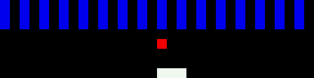</td>
    <td>Checkerboard</td>
    <td>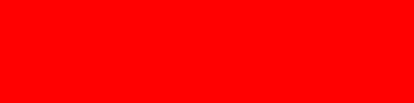</td>
  </tr>
  <tr>
    <td>Fireworks</td>
    <td></td>
     <td>PingPong</td>
    <td>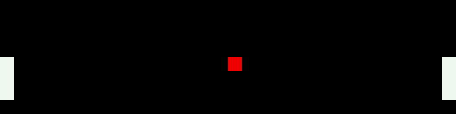</td>
  </tr>
  <tr>
    <td>Radar</td>
    <td>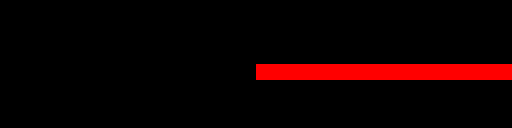</td>
     <td>Ripple</td>
    <td></td>
  </tr>
   <tr>
    <td>Snake</td>
    <td>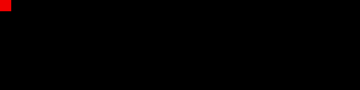</td>
     <td>TwinklingStars</td>
    <td></td>
  </tr>
   <tr>
    <td>TheaterChase</td>
    <td>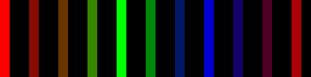</td>
      <td>ColorWaves</td>
    <td>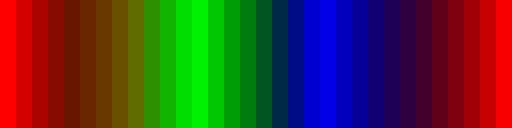</td>
  </tr>
     <tr>
    <td>SwirlOut</td>
    <td>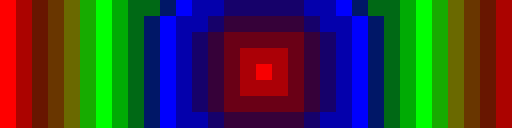</td>
    <td>SwirlIn</td>
    <td>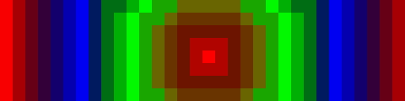</td>
  </tr>
<tr>
    <td>LookingEyes</td>
    <td></td>
     <td>Matrix</td>
    <td></td>
  </tr>
           <tr>
    <td>Pacifica</td>
    <td>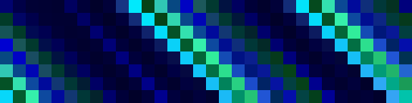</td>
     <td>Plasma</td>
    <td>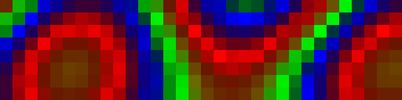</td>
  </tr>
               <tr>
    <td>PlasmaCloud</td>
    <td></td>
    <td>MovingLine</td>
    <td>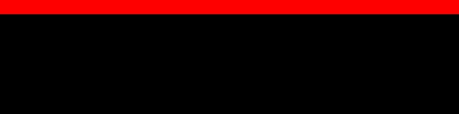</td>
  </tr>
  <tr>
    <td>Fade</td>
    <td>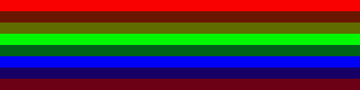</td>
    <td>Fire</td>
    <td></td>
  </tr>
</table>


# Налаштування ефектів
приклад:
```json
{
  "effect":"Plasma",
  "effectSettings":{
    "speed":3,
    "palette":"Rainbow",
    "blend":true
  }
}
```
Усі ключі налаштувань є необов'язковими

**speed:**
Зазвичай стандартне значення — 3. Більше значення означає швидше.
**palette:**
Кольорова палітра — це масив із 16 кольорів для створення переходів між кольорами.
Вбудовані палітри: `Cloud, Lava, Ocean, Forest, Stripe, Party, Heat, Rainbow`
**blend:**
Інтерполює між кольорами, створюючи широкий спектр проміжних відтінків для плавних колірних переходів.

Стандартні значення:

| Effect Name | Speed | Palette | Blend |
|-------------|-------|---------|-----------|
| Fade | 1 | Rainbow | true |
| MovingLine | 1 | Rainbow | true |
| BrickBreaker | - | - | - |
| PingPong | 8 | Rainbow | - |
| Radar | 1 | Rainbow | true |
| Checkerboard | 1 | Rainbow | true |
| Fireworks | 1 | Rainbow | true |
| PlasmaCloud | 3 | Rainbow | true |
| Ripple | 3 | Rainbow | true |
| Snake | 3 | Rainbow | - |
| Pacifica | 3 | Ocean | true |
| TheaterChase | 3 | Rainbow | true |
| Plasma | 2 | Rainbow | true |
| Matrix | 8 | - | - |
| SwirlIn | 4 | Rainbow | - |
| SwirlOut | 4 | Rainbow | - |
| LookingEyes | - | - | - |
| TwinklingStars | 4 | Ocean | false |
| ColorWaves | 3 | Rainbow | true |
| Fire | 5 | Heat | true |


# Посібник зі створення власної кольорової палітри

Цей посібник покаже вам, як створити власну кольорову палітру для використання з ефектами SVITRIX.

Кольорова палітра в SVITRIX — це масив із 16 кольорів. Кожен колір представлений як об'єкт `RGB`, який містить червону, зелену та синю складові.

SVITRIX використовує ці палітри для створення переходів між кольорами в ефектах. 16 кольорів у палітрі — це не єдині кольори, які будуть відображатися. Натомість SVITRIX інтерполює між цими кольорами, створюючи широкий спектр проміжних відтінків. Це забезпечує плавні, візуально приємні колірні переходи у ваших ефектах.

1. Створіть текстовий файл із розширенням `.txt` (наприклад, `sunny.txt`) у каталозі `/PALETTES/`.
2. У текстовому файлі визначте 16 кольорів у шістнадцятковому форматі. Кожен колір має бути на новому рядку. Колір визначається у форматі `#RRGGBB`, де `RR` — червона складова, `GG` — зелена складова, а `BB` — синя складова. Кожна складова — це двозначне шістнадцяткове число (від 00 до FF).

Наприклад, сонячна палітра може виглядати так:
Зверніть увагу, не використовуйте коментарі у файлі палітри.

```
0000FF   // Deep blue sky at the horizon's edge
0047AB   // Lighter sky
0080FF   // Even lighter sky
00BFFF   // Light blue sky
87CEEB   // Slightly cloudy sky
87CEFA   // Light blue sky
F0E68C   // Light clouds
FFD700   // Start of sun colors
FFA500   // Darker sun colors
FF4500   // Even darker sun colors
FF6347   // Red-orange sun colors
FF4500   // Dark sun colors
FFA500   // Bright sun colors
FFD700   // Bright yellow sun colors
FFFFE0   // Very bright sun colors
FFFFFF   // White sun colors, very bright light
```

Пам'ятайте, кольори, які ви визначаєте у палітрі, слугують ключовими точками в колірних переходах. SVITRIX інтерполює між цими кольорами, створюючи широкий спектр проміжних відтінків для плавних колірних переходів у ваших анімаціях. Експериментуйте з різним розміщенням кольорів у палітрі для досягнення різних візуальних ефектів. Ви можете використовувати blend=false, щоб не застосовувати інтерполяцію кольорів.

# Artnet (DMX)

SVITRIX підтримує Artnet одразу після встановлення.
Для [Jinx!](http://www.live-leds.de/) ви можете <a href="../svitrix_light.jnx" download>завантажити цей шаблон</a>. Просто змініть IP обох universes на IP вашого SVITRIX, і все готово.

**Для будь-якого іншого Artnet-контролера:**
Створіть 2 universes по 384 канали кожний. Також додайте нову матричну розкладку з 8 strings по 32 Strands та початковою позицією у верхньому лівому куті. Коли ви почнете надсилати дані, SVITRIX зупинить свою звичайну роботу та відображатиме ваші дані. Через 1 секунду після припинення надсилання даних SVITRIX повернеться до звичайної роботи.
